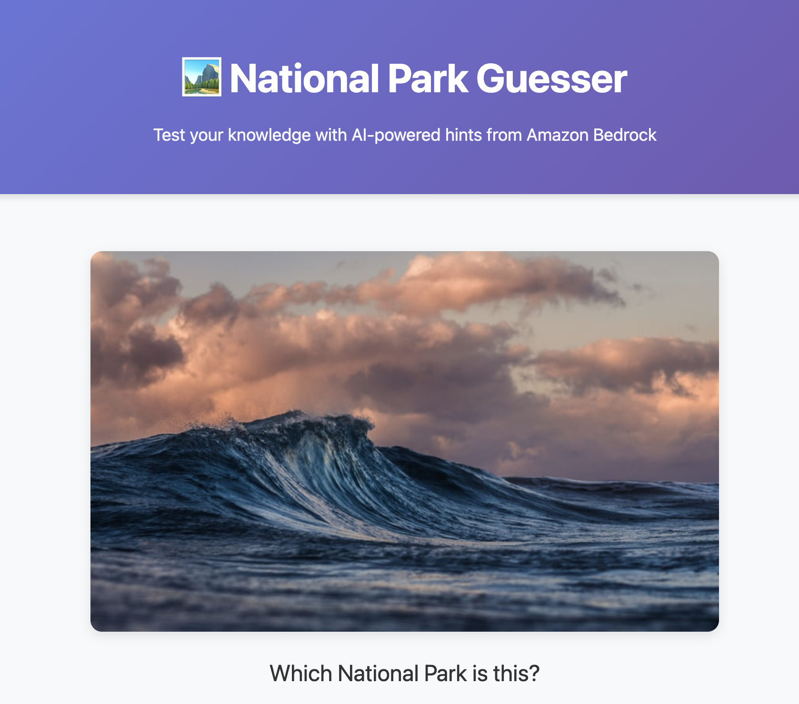

# terraform-aws-park-guesser
A National Park guessing game hosted on AWS ECS, deployed with Terraform (integration with AWS Bedrock)

## Documentation

- **[ARCHITECTURE.md](./ARCHITECTURE.md)** - Detailed architecture diagrams and infrastructure design
- **[DEVELOPMENT.md](./DEVELOPMENT.md)** - Development guide, setup instructions, and workflows

## Improvements to be made with more time
- Better application styling and functionality
- Better error handling
- Add more parks!

### Changes for Production:
1. Add Application Load Balancer in public subnets
2. Move ECS tasks to private subnets (no public IPs)
3. Add NAT Gateway for outbound internet access or VPC Endpoints (AWS APIs, Bedrock, etc.)
4. Span multiple AZs for high availability
5. Add SSL/TLS certificate on ALB

## Sources
- Images from https://www.nps.gov/
